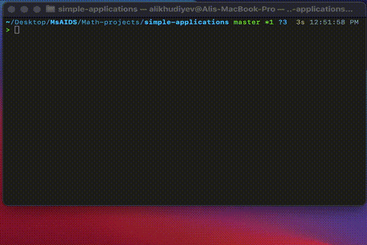
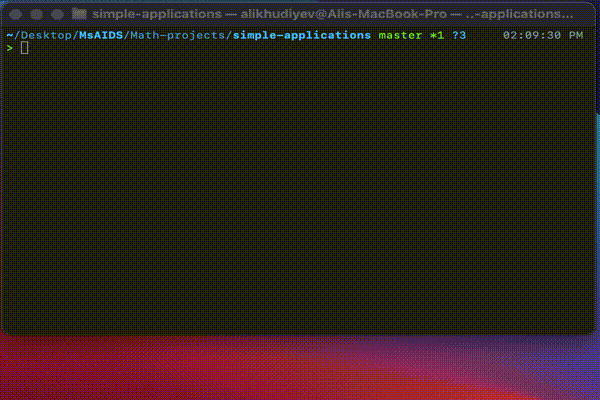

# Simple applications of some mathematical theories

This mini-project is to implement some mathematical theories(listed below) and see make simple applications for each of them.

## Lagrange interpolation

```bash
python lagrange-interpolation.py
```



## Bezier curve

```bash
python bezier-curve
```



## B-spline

```bash
python b-spline.py
```

## Similar matrices

```bash
python similar-matrices.py
```
